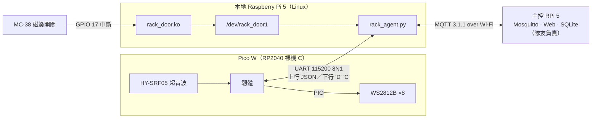

# 機櫃安全監測與告警模組（本地 Raspberry Pi 5 端）

團隊專題「智慧機房與環境控管預警系統」（資展國際 MEME53 第 4 組）分成環境告警、溫控、門禁、安全四個模組，這個 repo 是我負責的**安全模組**：偵測機櫃門被打開、有人靠近機櫃，在布防狀態下發出警報，經 MQTT 回報給主控端。

| Repo | 內容 |
|---|---|
| **Seminar_RPi5**（本 repo） | Python agent（`agent/`）、systemd／udev 部署設定（`deploy/`） |
| [rack-door-kmod](https://github.com/a9921/rack-door-kmod) | 門磁簧開關的 Linux kernel module `rack_door.ko` |
| [Seminar_PICOW](https://github.com/a9921/Seminar_PICOW) | Pico W 韌體：超音波測距、接近判斷、WS2812B 燈條、UART 回報 |

> 📹 DEMO 影片：錄製中

## 系統架構



分工原則：

- **Pico W**：時間要求嚴格的工作。WS2812B 的 NZR 波形容許誤差約 ±150 ns，交給 RP2040 的 PIO 狀態機產生；超音波測距與接近狀態判斷也在這層完成。
- **kernel module**：把門的 GPIO 中斷去彈跳後，變成乾淨的狀態事件。
- **agent**：整合兩個來源、執行布防／警報狀態機、負責與主控端的 MQTT 通訊。

## 我寫的程式

| 檔案 | 語言 | 行數 | 位置 |
|---|---|---|---|
| `rack_door.c` | C（Linux kernel） | 312 | rack-door-kmod |
| `ws2812.c` | C（Pico C SDK 2.3.0） | 343 | Seminar_PICOW |
| `rack_agent.py` | Python | 203 | `agent/` |
| `Makefile` | Make | 44 | rack-door-kmod |
| `rack-monitor.service` | systemd unit | 17 | `deploy/` |

Pico 韌體中的 `ws2812.pio` 取自 Pico SDK 官方範例，不是我寫的；`ws2812.c` 以 SDK 範例為起點，送色函式與 PIO 初始化沿用範例，其餘為自行撰寫。

## Agent 行為

### 資料來源

| 來源 | 內容 |
|---|---|
| `/dev/rack_door1` | 門狀態 `door_state_num`：1 開、0 關 |
| UART（`/dev/ttyAMA0`） | Pico 每行送一筆 JSON，含 `dist_mm`、`state`、`door` |

Pico 的 `state` 代碼：`0` error、`1` normal、`2` warn、`3` alert、`4` anomaly。

### 警報規則

- 布防（`armed`）中、且目前沒有警報時：
  - 門由關變開 → 警報 `UNAUTHORIZED_DOOR_OPEN`
  - Pico 狀態進入 alert → 警報 `UNAUTHORIZED_APPROCH`
- 警報觸發後會維持，直到收到 `RESET_ALARM`。
- 門狀態一改變就經 UART 送 `'D'`（開）或 `'C'`（關）給 Pico，同步燈條。
- MQTT 斷線時，本地判斷照常運作。

### MQTT 介面

| Topic | 方向 | QoS | Retain | Payload |
|---|---|---|---|---|
| `rack/security/state` | 發布 | 1 | ✔ | `{"timestamp", "armed"}` |
| `rack/security/event` | 發布 | 1 | | `{"timestamp", "alarm", "alarm_code"}` |
| `rack/security/telemetry` | 發布，每 5 秒 | 0 | | `{"timestamp", "status", "pico_state", "door_rack"}` |
| `rack/security/report-in` | 發布（含 LWT） | 1 | ✔ | `{"online": true \| false}` |
| `rack/security/cmd` | 訂閱 | 1 | | `{"action": "ARM" \| "DISARM" \| "RESET_ALARM"}` |

`alarm_code`：`NONE`、`UNAUTHORIZED_DOOR_OPEN`、`UNAUTHORIZED_APPROCH`。

### 斷線與重連

- `connect_async()` ＋ `reconnect_delay_set(1, 30)` ＋ `loop_start()`：啟動時 broker 不在也不會失敗，背景自動重連。
- 在 `on_connect` 裡重新訂閱、發布 `online: true`，並清掉「上次發布過的狀態」，讓主迴圈在重連後重送目前的 `state` 與 `event`。
- 異常斷線時 broker 代發 LWT `online: false`；正常結束時由程式自己發布 `online: false` 再斷線。

## 開機與生命週期

```
開機 → modules-load.d 載入 rack_door
     → device_create() 建立 /dev/rack_door1
     → udev 規則 TAG+="systemd" → dev-rack_door1.device
     → BindsTo 啟動 rack-monitor.service
```

- `rmmod rack_door` 時 systemd 自動停止 agent；`modprobe` 後由 udev 自動拉回，不需要下任何指令。
- 安裝步驟、前置需求與逐層排查方式見 [`deploy/README.md`](deploy/README.md)。

## 核心裁剪

在 WSL2 交叉編譯 `rpi-6.18.y`（6.18.48），以執行中 Pi 的 `lsmod` 快照（91 個模組）搭配 `localmodconfig` 裁剪，產生 `6.18.48-v8-16k+`。

| 項目 | 裁剪前 | 裁剪後 | 變化 |
|---|---|---|---|
| config 啟用選項 | 3853 | 1744 | −54.7% |
| `.ko` 檔案數 | 1895 | 109 | −94.2% |
| 模組樹大小 | 32 MB | 3.4 MB | −89.4% |
| `Image.gz` | 9.8 MB | 9.6 MB | |
| 執行時載入模組 | 91 | 89 | |

- 交叉編譯耗時 7 分 19 秒。
- 新舊核心並存（`kernel_2712-new.img`），改 `config.txt` 兩行即可切換；另有 SD 卡映像、開機分割區、原始碼三層備份。
- 實機驗證：`uname -r` 正確、Wi-Fi 取得 IP、自製驅動重新交叉編譯後載入成功、`rack-monitor.service` 自動啟動。

裁剪不是讓系統少做事，而是不再為不存在的硬體付出空間代價。

### 排查紀錄

| 現象 | 原因 |
|---|---|
| `brcmfmac_cyw` 找不到對應的 Kconfig 選項 | 它由 Makefile 的 `obj-m += cyw/` 無條件編譯，不受 Kconfig 控制 |
| 自製模組被拒絕載入 | `vermagic` 與新核心不符；這是核心的保護機制，需對新核心重新編譯 |
| 解壓模組後動態連結器失效 | `tar -C /` 覆蓋了 usrmerge 的 `/lib` 符號連結 |

## 硬體與開發環境

| 類別 | 項目 |
|---|---|
| 主機 | Raspberry Pi 5（Bookworm）、Raspberry Pi Pico W（RP2040 ＋ CYW43439） |
| 感測／輸出 | MC-38 磁簧開關、HY-SRF05 超音波、WS2812B ×8 |
| 工具鏈 | Pico C SDK 2.3.0、arm-none-eabi-gcc 15.2.1、aarch64-linux-gnu-gcc 15.2.0 |
| 開發 | VS Code Remote-SSH、WSL2、`mosquitto_sub` |

選型紀錄：門感測器原本用霍爾感測器，因門檻餘裕小於溫漂而改為 MC-38 乾接點磁簧開關（`hall_test.py` 是當時的測試程式）；本地處理原規劃用 Node.js，後來改為 kernel module ＋ Python agent。
